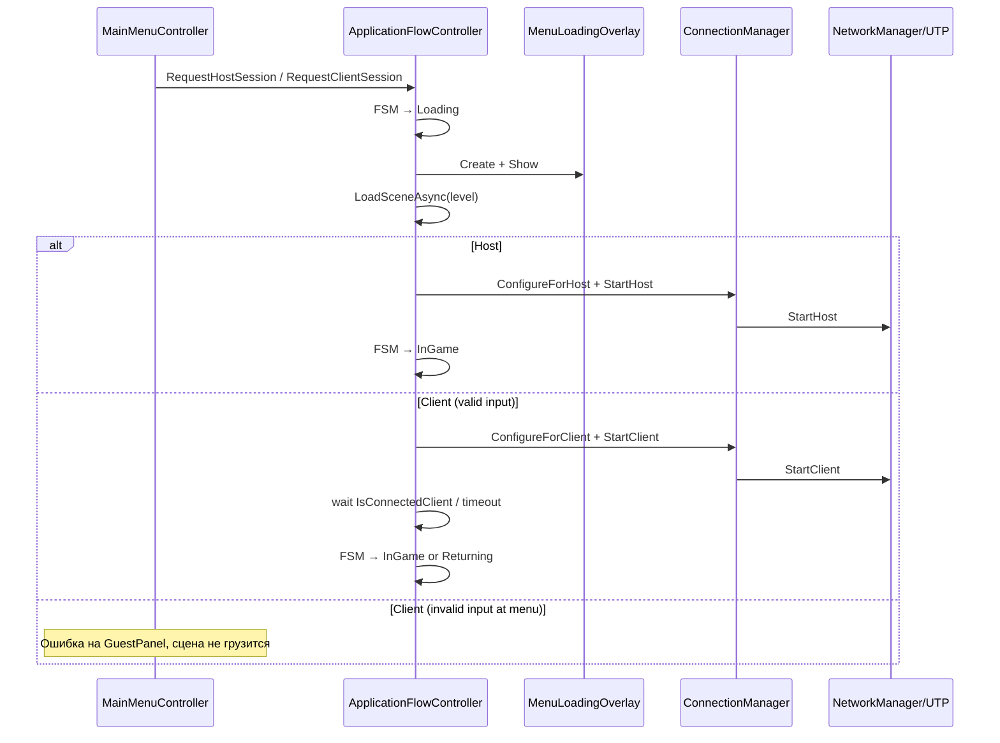

# MainMenu и сетевой вход (NGO + UTP)

Как устроен вход в игру, как тестировать мультиплеер и как работает защита от неверного ввода гостя.

См. также: `Architecture-Snapshot.md`, `Development-Status.md`, `Stage 2.md`.

---

## Зачем эта система

- **Единая точка входа** для билда (`MainMenu` первая в Build Settings).
- **Разделение UI и flow**: `MainMenuController` только UI; загрузка и NGO — `ApplicationFlowController`.
- **FSM потока приложения**: MainMenu → Loading → InGame → Returning.
- **Fallback NGO-старт** на Sandbox через `GameplayNetworkSessionStarter` (dev Play, `-join`).
- **Защита от неверного ввода** гостя — невалидный IP не должен ломать Transport.

---

## Поток данных (основной путь)



**Fallback:** если сцену Sandbox открыли напрямую (Play Mode), `GameplayNetworkSessionStarter` поднимает host/client без меню.

---

## FSM потока (`ApplicationFlowController`)

| Состояние | Когда | Действие |
|-----------|-------|----------|
| `MainMenu` | Старт / после возврата | UI ждёт запроса сессии |
| `Loading` | Host/Guest нажал старт | Загрузка сцены + NGO connect |
| `InGame` | Сессия активна | `GameplaySessionGuard` следит за disconnect |
| `Returning` | Exit / ошибка / disconnect | Stop NGO → Load MainMenu |

DontDestroyOnLoad bootstrap: `ApplicationFlowController` создаётся до первой сцены (`RuntimeInitializeOnLoadMethod`).

---

## Ключевые скрипты

| Скрипт | Роль |
|--------|------|
| `ApplicationFlowController` | FSM, bootstrap DontDestroyOnLoad |
| `IAppFlowCommands` / `AppFlow` | Публичный API flow для UI и network слоёв |
| `AppFlowSessionConnectService` | LoadSceneAsync + overlay + NGO connect |
| `AppFlowReturnToMenuService` | Stop NGO + load MainMenu |
| `AppFlowReturnFeedbackRegistry` | `MenuReturnReason` → handler → `MenuReturnFeedback` |
| `MainMenuController` | UI: Host / Guest / Settings / Level select |
| `MenuConfig` | SO: порт, fallback-сцена, таймауты, splash overlay |
| `MenuLoadPresentation` | Runtime DTO overlay-параметров из `MenuConfig` |
| `MainMenuLocalizedText` | LAN IP-хинт, локализованные ошибки |
| `MenuReturnFeedback` | Статический «конверт» feedback при возврате в меню |
| `MenuReturnReason` | Причина возврата (disconnect, timeout, user exit) |
| `NetworkSessionIntent.LaunchPayload` | DTO host/client; in-memory в flow |
| `MenuLoadingOverlay` | Полноэкранная загрузка (DontDestroyOnLoad) |
| `NetworkSessionConnectRoutines` | Общие coroutine host/client connect |
| `GameplayNetworkSessionStarter` | Dev fallback на Sandbox (Play, `-join`) |
| `GameplaySessionGuard` | Мониторинг сессии, сигнал о завершении |
| `ConnectionManager` | UTP configure, Start/Stop, ServiceLocator |
| `ClientConnectInputValidator` | IP/hostname/port до UTP |
| `NetworkLocalAddressHints` | CSV LAN IPv4 для подсказки хоста |
| `DevelopmentJoinArgs` | CLI `-join` для dev-билдов |
| `DevNetworkBootstrap` | Legacy автостарт, если нет SessionStarter |

---

## Роли Host и Guest

### Host (кнопка «Начать игру» / Level select)

1. `MainMenuController` → `ApplicationFlowController.RequestHostSession(port, scene, presentation)`.
2. FSM → Loading → overlay → `LoadSceneAsync`.
3. `ConnectionManager.ConfigureForHost(port)` → `StartHost()`.
4. Слушатель: **`serverListenAddress = 0.0.0.0`** — принимает клиентов по LAN.

### Guest (панель Connect)

1. Ввод IP и порта.
2. **Валидация в меню** (`ClientConnectInputValidator`).
3. При успехе — `RequestClientSession` → Loading → Sandbox → `StartClient()`.
4. Ожидание `IsConnectedClient` до таймаута (`MenuLoadPresentation.ClientConnectTimeoutSeconds`, по умолчанию ~20 с).
5. При failure/timeout — `AppFlowReturnFeedbackRegistry` → `MenuReturnFeedback` → FSM Returning → MainMenu, GuestPanel с ошибкой и прежним IP/портом.

**Цепочка guest failure:**
```
MainMenuController.OnGuestConnectClicked
  → ApplicationFlowController.RequestClientSession
  → Loading → MenuLoadingOverlay → LoadSceneAsync
  → NetworkSessionConnectRoutines.ConnectClient (timeout)
  → AppFlowReturnFeedbackRegistry.Apply(GuestConnectionFailed)
  → Returning → Load MainMenu
  → MainMenuController.ApplyReturnedMenuState → ShowGuestPanel + ShowConnectionError
```

---

## Валидация guest connect

### Что принимается

| Тип | Примеры |
|-----|---------|
| IPv4 | `127.0.0.1`, `192.168.0.5` |
| Localhost | `localhost` (без учёта регистра) |
| Hostname | `my-pc.local`, `hamachi.example` (должна быть **хотя бы одна буква**) |

### Что отклоняется

| Ввод | Причина |
|------|---------|
| Пустой IP | `EmptyHost` |
| `111`, `999` | Чисто числовое — UTP не считает hostname |
| `1.2.3` | Неполный IPv4 |
| Пустой/некорректный порт | `InvalidPort` |

### Три слоя защиты

1. **MainMenu** — ошибка на месте, сцена не грузится.
2. **ApplicationFlowController** — повторная валидация + timeout client connect.
3. **ConnectionManager** — последний барьер, без вызова UTP при невалидном вводе.

### Локализованные ошибки

| Ключ | Когда |
|------|-------|
| `menu.error.empty_host` | Пустой IP |
| `menu.error.invalid_address` | Неверный IP/hostname |
| `menu.error.invalid_port` | Неверный порт |
| `menu.error.connection_failed` | Timeout / хост не запущен |
| `menu.error.host_disconnected` | Хост отключился |
| `menu.error.session_ended` | Сессия завершена хостом |

---

## Настройка в Unity

### Build Settings

1. **MainMenu** — index 0.
2. **Sandbox** / уровни из `LevelCatalog` — в Build Profiles.

### MainMenu сцена

- `MainMenuController` — кнопки, панели, level select; ссылка на **`MenuConfig`** asset.
- `MainMenuLocalizedText` — динамические строки ошибок.

**MenuConfig** (`Configs/MenuConfig.asset`): порт хоста, fallback-сцена guest, `minimumSecondsLoadingScreen`, `overlayHoldSecondsAfterConnect`, `clientConnectTimeoutSeconds`, `loadingSplashSpriteOptional`.

Создание/проверка: **Catsss → Menu → Create Default Menu Config**.

Локализация: **Catsss → Localization → Setup UI Strings (RU + EN)**.

### Sandbox / уровни

На объекте с **NetworkManager**:

- `ConnectionManager` — port, address defaults.
- `GameplayNetworkSessionStarter` — fallback для dev Play и `-join`.
- `TrialSessionRegistry`, gameplay systems.

`ApplicationFlowController` создаётся автоматически — **не нужно** вешать на сцену.

---

## Как тестировать

### Один ПК, два процесса

1. Play MainMenu → **Host**.
2. Build или второй Editor → **Guest** → IP `127.0.0.1`, тот же порт.
3. Оба игрока в Sandbox.

### LAN (два ПК)

1. Host смотрит LAN IP в подсказке меню.
2. Guest вводит IP + порт.
3. Firewall: разрешить входящие на порт игры.

### Dev CLI (без меню)

Запуск Sandbox с **`-join`** — клиент на `127.0.0.1`.

### Негативные тесты

| Действие | Ожидание |
|----------|----------|
| IP `111`, Connect | Ошибка на GuestPanel, сцена не грузится |
| Пустой IP | «Введите IP…» |
| Порт `abc` | «Неверный порт…» |
| Валидный IP, хост выключен | Loading → timeout → MainMenu + connection_failed |
| Esc → Exit session | Returning → MainMenu |

---

## Осознанные ограничения

- **Нет Unity Relay** — интернет без VPN/проброса порта не поддерживается.
- **Нет join-кода** — только IP + port.
- **ApplicationFlowController** — единственный bootstrap на DontDestroyOnLoad; внешний код использует `AppFlow.TryGet` / `IAppFlowCommands`.

---

## Возможные улучшения

- **Unity Relay / UGS** — join без прямого IP.
- **Guest connect overlay** — текст «Подключение…» поверх splash на client path.
- **Connect до загрузки сцены** — меньше лишней загрузки уровня при мёртвом хосте.
