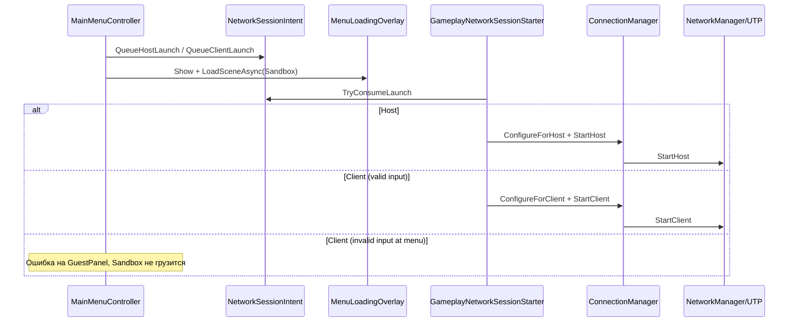

# MainMenu и сетевой вход (NGO + UTP)

Как устроен вход в игру, как тестировать мультиплеер и как работает защита от неверного ввода гостя.

См. также: `Architecture-Snapshot.md`, `Development-Status.md` (этапы 3–5), `Stage 2.md`.

---

## Зачем эта система

- **Единая точка входа** для билда (`MainMenu` первая в Build Settings).
- **Разделение UI и геймплея**: меню не знает про trials/dash — только ставит intent и грузит Sandbox.
- **Предсказуемый NGO-старт** на геймплей-сцене через один компонент (`GameplayNetworkSessionStarter`).
- **Защита от дурака** на guest connect — невалидный IP не должен ломать Transport и сцену.

---

## Поток данных

---

## Ключевые скрипты

| Скрипт | Роль |
|--------|------|
| `MainMenuController` | UI: Host / Guest panel / Quit; валидация перед connect |
| `MainMenuLocalizedText` | LAN IP-хинт, локализованные ошибки GuestPanel |
| `NetworkSessionIntent` | Статический «конверт» host/client + port между сценами |
| `MenuLoadingOverlay` | Полноэкранная загрузка, DontDestroyOnLoad |
| `GameplayNetworkSessionStarter` | На Sandbox: intent → StartHost/Client, timeout клиента |
| `ConnectionManager` | UTP configure, Start/Stop, ServiceLocator |
| `ClientConnectInputValidator` | IP/hostname/port до UTP |
| `MenuConnectionFeedback` | Флаг «вернуться в меню с ошибкой» |
| `NetworkLocalAddressHints` | CSV LAN IPv4 для подсказки хоста |
| `DevelopmentJoinArgs` | CLI `-join` для dev-билдов |
| `DevNetworkBootstrap` | Legacy автостарт, если нет SessionStarter |

---

## Роли Host и Guest

### Host (кнопка «Начать игру»)

1. `NetworkSessionIntent.QueueHostLaunch(hostPort, overlayHold)`.
2. Загрузка Sandbox.
3. `ConnectionManager.ConfigureForHost(port)` → `StartHost()`.
4. Слушатель: **`serverListenAddress = 0.0.0.0`** — принимает клиентов по LAN.

**Порт** в MainMenu (`hostPort`, по умолчанию 7777) должен совпадать с `ConnectionManager.port` на Sandbox.

### Guest (панель Connect)

1. Ввод IP и порта.
2. **Валидация в меню** (`ClientConnectInputValidator`).
3. При успехе — `QueueClientLaunch(ip, port)` → Sandbox → `ConfigureForClient` → `StartClient()`.
4. Ожидание `IsConnectedClient` до **10 с** (`clientConnectTimeoutSeconds`).
5. При failure/timeout — `MenuConnectionFeedback` + загрузка MainMenu, GuestPanel открыта с ошибкой.

---

## Валидация guest connect

### Что принимается

| Тип | Примеры |
|-----|---------|
| IPv4 | `127.0.0.1`, `192.168.0.5` |
| Localhost | `localhost` (без учёта регистра) |
| Hostname | `my-pc.local`, `hamachi.example` (должна быть **хотя бы одна буква**) |

### Что отклоняется

| Ввод | Причина |
|------|---------|
| Пустой IP | `EmptyHost` |
| `111`, `999` | Чисто числовое — UTP не считает hostname |
| `1.2.3` | Неполный IPv4 |
| Пустой/некорректный порт | `InvalidPort` (раньше silently fallback на 7777 — убрано) |

### Три слоя защиты

1. **MainMenu** — ошибка на месте, Sandbox не грузится.
2. **GameplayNetworkSessionStarter** — если intent испорчен, возврат в меню **без** `StartClient`.
3. **ConnectionManager** — последний барьер, без вызова UTP.

### Локализованные ошибки

| Ключ | Когда |
|------|-------|
| `menu.error.empty_host` | Пустой IP |
| `menu.error.invalid_address` | Неверный IP/hostname |
| `menu.error.invalid_port` | Неверный порт |
| `menu.error.connection_failed` | Timeout / хост не запущен / transport после валидного ввода |

---

## Настройка в Unity

### Build Settings

1. **MainMenu** — index 0.
2. **Sandbox** — index 1.

### MainMenu сцена

На объекте **MainMenu**:

- `MainMenuController` — ссылки на кнопки, GuestPanel, input fields.
- `MainMenuLocalizedText` — `connectionErrorTmp` → `GuestPanel/ConnectionErrorText`.

После изменений локализации:

- **Catsss → Localization → Setup UI Strings (RU + EN)**
- **Catsss → Localization → Setup MainMenu Scene Texts**

### Sandbox сцена

На объекте с **NetworkManager**:

- `ConnectionManager` — port, address defaults.
- `GameplayNetworkSessionStarter` — `mainMenuSceneName = MainMenu`, timeout клиента.

---

## Как тестировать

### Один ПК, два процесса

1. Play MainMenu → **Host**.
2. Build или второй Editor → **Guest** → IP `127.0.0.1`, тот же порт.
3. Оба игрока должны заспавниться в Sandbox.

### LAN (два ПК в одной сети)

1. Host смотрит LAN IP в подсказке меню (или `ipconfig`).
2. Guest вводит этот IP + порт.
3. Firewall Windows: разрешить входящие на порт Unity/игры.

### Hamachi / VPN

- Guest подключается к **VPN-IP хоста**, не к локальному 192.168.x.x за NAT.

### Dev CLI (без меню)

Запуск билда Sandbox с аргументом **`-join`** — клиент на `127.0.0.1` и порт из `ConnectionManager`.

### Негативные тесты (guest validation)

| Действие | Ожидание |
|----------|----------|
| IP `111`, Connect | Ошибка на GuestPanel, Sandbox не грузится |
| Пустой IP | «Введите IP…» |
| Порт `abc` | «Неверный порт…» |
| Валидный IP, хост выключен | Загрузка → timeout → возврат в меню с connection_failed |

---

## Осознанные ограничения

- **Нет Unity Relay** — интернет между разными провайдерами без VPN/проброса порта не поддерживается «из коробки».
- **Нет join-кода** — только IP + port.
- **Ошибки host start** (порт занят) — warning в Console; отдельный UI для хоста пока минимален.

---

## Расширение (идеи на будущее)

- Event Channel `SessionConnectedChannel` вместо статического feedback.
- UI ошибки для Host (порт занят).
- Live-валидация полей (disable Connect пока ввод невалиден).
- Интеграция Unity Relay при переходе на UGS.
